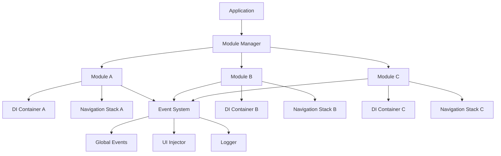
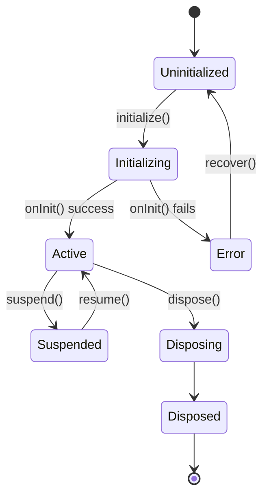

# Mosaic

[](https://pub.dev/packages/mosaic)
[](https://opensource.org/licenses/BSD-3-Clause)
[](https://flutter.dev)
[](https://dart.dev)

Mosaic is a comprehensive Flutter architecture framework designed for building scalable, modular applications. It provides a complete ecosystem for managing large applications through independent modules with their own lifecycle, dependencies, and communication patterns.

## Table of Contents

- [Architecture Overview](#architecture-overview)
- [Core Components](#core-components)
- [Installation](#installation)
- [Quick Start](#quick-start)
- [Module Lifecycle](#module-lifecycle)
- [Event System](#event-system)
  - [Basic Events](#basic-events)
  - [Wildcard Patterns](#wildcard-patterns)
  - [Event Chains with Segments](#event-chains-with-segments)
  - [Retained Events](#retained-events)
- [Navigation](#navigation)
  - [Inter-Module Navigation](#inter-module-navigation)
  - [Intra-Module Navigation](#intra-module-navigation)
  - [Navigation Extensions](#navigation-extensions)
- [Dependency Injection](#dependency-injection)
- [UI Injection](#ui-injection)
- [Reactive State Management](#reactive-state-management)
  - [Signals](#signals)
  - [Computed Signals](#computed-signals)
- [Logging System](#logging-system)
  - [Basic Logging](#basic-logging)
  - [Logger Configuration](#logger-configuration)
- [Thread Safety](#thread-safety)
  - [Mutex for Safe Data Access](#mutex-for-safe-data-access)
  - [Semaphore for Concurrency Control](#semaphore-for-concurrency-control)
  - [Auto Retry Queue](#auto-retry-queue)
- [CLI Tool Usage](#cli-tool-usage)
  - [Project Management](#project-management)
  - [Module Management](#module-management)
  - [Profile System](#profile-system)
  - [Code Generation](#code-generation)
- [Testing](#testing)
  - [Module Testing](#module-testing)
  - [Event System Testing](#event-system-testing)
- [Production Considerations](#production-considerations)
  - [Performance Optimization](#performance-optimization)
  - [Error Handling](#error-handling)
  - [Security](#security)
  - [Monitoring](#monitoring)
- [Migration Guide](#migration-guide)
  - [From Existing Architecture](#from-existing-architecture)
  - [Breaking Changes](#breaking-changes)
- [Contributing](#contributing)
  - [Development Setup](#development-setup)
- [License](#license)
- [Support](#support)

## Architecture Overview

Mosaic implements a module-based architecture where each feature is encapsulated as an independent module with its own:

- **Lifecycle Management**: Initialize, activate, suspend, resume, and dispose modules
- **Dependency Injection**: Isolated DI containers per module
- **Event System**: Type-safe inter-module communication
- **Navigation Stack**: Internal navigation within modules
- **UI Injection**: Dynamic UI component injection across modules



## Core Components

### Module System
Modules are the fundamental building blocks of a Mosaic application. Each module represents a feature or domain with complete isolation from other modules.

### Event-Driven Communication
A robust event system enables decoupled communication between modules using channels, wildcards, and type-safe data exchange.

### Dynamic UI Injection
Inject UI components from one module into designated areas of another module without creating tight coupling.

### Comprehensive Logging
Multi-dispatcher logging system supporting console, file, and custom outputs with tag-based filtering and automatic rate limiting.

### Thread Safety
Built-in concurrency primitives including mutexes, semaphores, and automatic retry queues for safe multi-threaded operations.

## Installation

Add Mosaic to your `pubspec.yaml`:

```yaml
dependencies:
  mosaic: ^1.0.1
```

Install the CLI tool globally:

```bash
dart pub global activate mosaic
```

## Quick Start

### 1. Create a New Project

```bash
mosaic init my_app
cd my_app
```

### 2. Add Modules (Tesserae)

```bash
mosaic tessera add user
mosaic tessera add dashboard
mosaic tessera add settings
```

### 3. Define Module Implementation

```dart
// lib/user/user.dart
import 'package:flutter/material.dart';
import 'package:mosaic/mosaic.dart';

class UserModule extends Module {
  UserModule() : super(name: 'user');

  @override
  Widget build(BuildContext context) {
    return UserHomePage();
  }

  @override
  Future<void> onInit() async {
    // Initialize services
    di.put<UserRepository>(UserRepositoryImpl());
    di.put<AuthService>(AuthServiceImpl());
    
    // Setup event listeners
    events.on<String>('auth/logout', _handleLogout);
  }

  void _handleLogout(EventContext<String> context) {
    // Handle logout logic
    clear(); // Clear navigation stack
  }
}

class UserHomePage extends StatelessWidget {
  @override
  Widget build(BuildContext context) {
    return Scaffold(
      appBar: AppBar(title: Text('User Profile')),
      body: Column(
        children: [
          Text('Welcome to User Module'),
          ElevatedButton(
            onPressed: () => context.go('dashboard'),
            child: Text('Go to Dashboard'),
          ),
        ],
      ),
    );
  }
}

final module = UserModule();
```

### 4. Configure Application

```dart
// lib/main.dart
import 'package:flutter/material.dart';
import 'package:mosaic/mosaic.dart';
import 'init.dart'; // Generated by CLI

void main() async {
  WidgetsFlutterBinding.ensureInitialized();
  
  // Initialize logger
  await mosaic.logger.init(
    tags: ['app', 'navigation', 'events'],
    dispatchers: [
      ConsoleDispatcher(),
      FileLoggerDispatcher(path: 'logs'),
    ],
  );

  // Initialize modules
  await init();

  runApp(MyApp());
}

class MyApp extends StatelessWidget {
  @override
  Widget build(BuildContext context) {
    return MaterialApp(
      title: 'My Mosaic App',
      home: MosaicScope(),
    );
  }
}
```

## Module Lifecycle

Modules follow a comprehensive lifecycle with automatic state management:



### Lifecycle Hooks

```dart
class MyModule extends Module {
  @override
  Future<void> onInit() async {
    // Called during initialization
    // Setup services, load configuration
  }

  @override
  void onActive(RouteTransitionContext ctx) {
    // Called when module becomes active
    // Start background tasks, refresh data
  }

  @override
  Future<void> onSuspend() async {
    // Called when module is suspended
    // Pause operations, save state
  }

  @override
  Future<void> onDispose() async {
    // Called during cleanup
    // Release resources, save persistent state
  }

  @override
  Future<bool> onRecover() async {
    // Called to recover from error state
    return true; // Return false to prevent recovery
  }
}
```

## Event System

### Basic Events

```dart
// Listen to events
events.on<UserData>('user/profile/updated', (context) {
  print('Profile updated: ${context.data?.name}');
});

// Emit events
events.emit<UserData>('user/profile/updated', userData);
```

### Wildcard Patterns

```dart
// Listen to any user event
events.on<dynamic>('user/*', (context) {
  print('User event: ${context.name}');
  // context.params contains matched segments
});

// Listen to all nested events
events.on<dynamic>('user/profile/#', (context) {
  print('Profile event: ${context.params}');
});
```

### Event Chains with Segments

```dart
class UserEvents extends Segment {
  UserEvents() : super('user');
}

final userEvents = UserEvents();

// Chain event paths
userEvents.$('profile').$('avatar').emit<String>('new_avatar.jpg');

// Listen to chained events
userEvents.$('profile').$('*').on<dynamic>((context) {
  print('Profile event: ${context.params[0]}');
});
```

### Retained Events

```dart
// Emit retained event
events.emit<bool>('app/ready', true, true);

// Late subscribers will receive the retained event
events.on<bool>('app/ready', (context) {
  print('App is ready: ${context.data}');
});
```

## Navigation

### Inter-Module Navigation

```dart
// Navigate between modules
await router.go<String>('dashboard');
await router.go<UserData>('user', currentUser);

// Go back to previous module
router.goBack<String>('Operation completed');
```

### Intra-Module Navigation

```dart
// Push page within current module
final result = await router.push<String>(EditProfilePage());

// Pop from module stack
router.pop<String>('Profile saved');

// Clear module stack
router.clear();
```

### Navigation Extensions

```dart
// Context extensions for convenient navigation
ElevatedButton(
  onPressed: () => context.go('settings'),
  child: Text('Settings'),
)

ElevatedButton(
  onPressed: () async {
    final result = await context.push<bool>(EditPage());
    if (result == true) {
      // Handle success
    }
  },
  child: Text('Edit'),
)
```

## Dependency Injection

Each module has its own isolated DI container:

```dart
class MyModule extends Module {
  @override
  Future<void> onInit() async {
    // Singleton instance
    di.put<DatabaseService>(DatabaseServiceImpl());
    
    // Factory (new instance each time)
    di.factory<HttpClient>(() => HttpClient());
    
    // Lazy singleton (created on first access)
    di.lazy<ExpensiveService>(() => ExpensiveService());
  }

  void someMethod() {
    final db = di.get<DatabaseService>();
    final client = di.get<HttpClient>(); // New instance
    final expensive = di.get<ExpensiveService>(); // Created if needed
  }
}
```

## UI Injection

Dynamically inject UI components across modules:

```dart
// In source module - inject component
class ProfileModule extends Module {
  @override
  void onInit() {
    injector.inject(
      'dashboard/sidebar',
      ModularExtension(
        (context) => ListTile(
          leading: Icon(Icons.person),
          title: Text('Profile'),
          onTap: () => context.go('profile'),
        ),
        priority: 1,
      ),
    );
  }
}

// In target module - receive components
class DashboardSidebar extends ModularStatefulWidget {
  const DashboardSidebar({Key? key}) 
    : super(key: key, path: ['dashboard', 'sidebar']);

  @override
  ModularState<DashboardSidebar> createState() => _DashboardSidebarState();
}

class _DashboardSidebarState extends ModularState<DashboardSidebar> {
  _DashboardSidebarState() : super('sidebar');

  @override
  Widget build(BuildContext context) {
    return Column(
      children: [
        Text('Dashboard Menu'),
        ...extensions.map((ext) => ext.builder(context)),
      ],
    );
  }
}
```

## Reactive State Management

### Signals

```dart
class CounterModule extends Module {
  final counter = Signal<int>(0);
  final user = AsyncSignal<User>(() => api.getCurrentUser());

  @override
  Widget build(BuildContext context) {
    return Column(
      children: [
        // Watch signal changes
        counter.when(
          Text('Count: ${counter.state}'),
        ),
        
        // Handle async state
        user.then(
          success: (user) => Text('Hello ${user.name}'),
          loading: () => CircularProgressIndicator(),
          error: (error) => Text('Error: $error'),
          orElse: () => Text('No user data'),
        ),
        
        ElevatedButton(
          onPressed: () => counter.state++,
          child: Text('Increment'),
        ),
      ],
    );
  }
}
```

### Computed Signals

```dart
final name = Signal<String>('John');
final age = Signal<int>(25);

// Computed signal automatically updates
final greeting = name.computed((value) => 'Hello, $value');

// Combined signals
final profile = name.combine(age, (name, age) => '$name ($age years old)');
```

## Logging System

### Basic Logging

```dart
class MyModule extends Module with Loggable {
  @override
  List<String> get loggerTags => ['user', 'authentication'];

  Future<void> loginUser(String email) async {
    info('Login attempt for $email'); // Auto-tagged
    
    try {
      final user = await authService.login(email);
      info('Login successful for $email');
    } catch (e) {
      error('Login failed: $e');
    }
  }
}
```

### Logger Configuration

```dart
await logger.init(
  tags: ['app', 'network', 'database'],
  dispatchers: [
    ConsoleDispatcher(),
    FileLoggerDispatcher(
      path: 'logs',
      fileNameRole: (tag) => '${tag}_${DateTime.now().day}.log',
    ),
  ],
);

// Add message formatters
logger.addWrapper(Logger.addData); // Timestamp
logger.addWrapper(Logger.addType); // Log level
logger.addWrapper(Logger.addTags); // Tag list

// Set log level for production
logger.setLogLevel(LogLevel.warning);
```

## Thread Safety

### Mutex for Safe Data Access

```dart
final userCache = Mutex<Map<String, User>>({});

// Safe read/write operations
final users = await userCache.get();
await userCache.set({...users, 'new_id': newUser});

// Safe compound operations
await userCache.use((users) async {
  users['user_id'] = await loadUser('user_id');
  await saveToDatabase(users);
});
```

### Semaphore for Concurrency Control

```dart
final downloadSemaphore = Semaphore(); // Allow 1 concurrent operation

Future<void> downloadFile(String url) async {
  await downloadSemaphore.lock();
  try {
    // Download file
  } finally {
    downloadSemaphore.release();
  }
}
```

### Auto Retry Queue

```dart
final queue = InternalAutoQueue(maxRetries: 3);

// Operations are automatically retried on failure
final result = await queue.push<String>(() async {
  final response = await http.get(unreliableEndpoint);
  if (response.statusCode != 200) throw Exception('HTTP ${response.statusCode}');
  return response.body;
});
```

## CLI Tool Usage

### Project Management

```bash
# Create new project
mosaic init my_project

# Show project status
mosaic status

# List all modules
mosaic tessera list
```

### Module Management

```bash
# Add new module
mosaic tessera add user_profile

# Enable/disable modules
mosaic tessera enable user_profile
mosaic tessera disable old_feature

# Manage dependencies
mosaic deps add user_profile authentication
mosaic deps remove user_profile old_service
```

### Profile System

```bash
# Create development profile
mosaic profile add development user_profile dashboard settings

# Switch profiles
mosaic profile switch development

# Run profile-specific commands
mosaic run development
mosaic build production
```

### Code Generation

```bash
# Generate type-safe event classes
mosaic events generate

# Sync modules and generate init files
mosaic sync
```

## Testing

### Module Testing

```dart
import 'package:flutter_test/flutter_test.dart';
import 'package:mosaic/mosaic.dart';

void main() {
  group('UserModule Tests', () {
    late UserModule userModule;
    late MockUserRepository mockRepo;

    setUp(() async {
      userModule = UserModule();
      mockRepo = MockUserRepository();
      
      // Override dependencies for testing
      userModule.di.override<UserRepository>(mockRepo);
      
      await userModule.initialize();
    });

    tearDown(() async {
      await userModule.dispose();
    });

    test('should load user profile on init', () async {
      when(mockRepo.getCurrentUser()).thenAnswer((_) async => testUser);
      
      await userModule.onInit();
      
      verify(mockRepo.getCurrentUser()).called(1);
    });

    test('should handle navigation stack', () async {
      final widget = ProfileEditPage();
      final future = userModule.push<String>(widget);
      
      expect(userModule.stackDepth, equals(1));
      
      userModule.pop<String>('saved');
      final result = await future;
      
      expect(result, equals('saved'));
      expect(userModule.stackDepth, equals(0));
    });
  });
}
```

### Event System Testing

```dart
group('Events Tests', () {
  test('should emit and receive events', () async {
    String? receivedData;
    
    events.on<String>('test/event', (context) {
      receivedData = context.data;
    });
    
    events.emit<String>('test/event', 'test data');
    
    await Future.delayed(Duration.zero);
    expect(receivedData, equals('test data'));
  });

  test('should handle wildcard patterns', () async {
    final receivedEvents = <String>[];
    
    events.on<String>('user/*/update', (context) {
      receivedEvents.add(context.params[0]);
    });
    
    events.emit<String>('user/profile/update', 'profile data');
    events.emit<String>('user/settings/update', 'settings data');
    
    await Future.delayed(Duration.zero);
    expect(receivedEvents, containsAll(['profile', 'settings']));
  });
});
```

## Production Considerations

### Performance Optimization

- Use specific log tags in production to reduce overhead
- Set appropriate log levels (warning or error) for production
- Enable rate limiting for high-traffic event channels
- Consider lazy loading for expensive module dependencies

### Error Handling

- Implement comprehensive error recovery in modules
- Use circuit breaker patterns for external service calls
- Monitor module health status regularly
- Set up alerting for critical module failures

### Security

- Validate all data passed through events
- Sanitize user inputs in UI injection components
- Use proper access controls for sensitive modules
- Regular security audits of inter-module communications

### Monitoring

```dart
// Monitor module health
final healthStatus = mosaic.registry.getHealthStatus();
for (final entry in healthStatus.entries) {
  final moduleName = entry.key;
  final health = entry.value;
  
  if (health['hasError']) {
    alertService.notifyModuleError(moduleName, health['lastError']);
  }
}
```

## Migration Guide

### From Existing Architecture

1. **Identify Feature Boundaries**: Map existing features to modules
2. **Extract Dependencies**: Move shared services to appropriate modules
3. **Convert Navigation**: Replace existing routing with Mosaic navigation
4. **Update State Management**: Migrate to Signals or keep existing solution
5. **Add Event Communication**: Replace tight coupling with events

### Breaking Changes

See [CHANGELOG.md](CHANGELOG.md) for detailed migration instructions between versions.

## Contributing

We welcome contributions! Please see our [Contributing Guidelines](CONTRIBUTING.md) for details.

### Development Setup

```bash
# Clone repository
git clone https://github.com/marcomit/mosaic.git
cd mosaic

# Install dependencies
flutter pub get

# Run tests
flutter test

# Install CLI locally
dart pub global activate --source path .
```

## License

This project is licensed under the BSD 3-Clause License. See [LICENSE](LICENSE) for details.

## Support

- **Documentation**: [Mosaic Docs](https://pub.dev/packages/mosaic)
- **Issues**: [GitHub Issues](https://github.com/marcomit/mosaic/issues)
- **Discussions**: [GitHub Discussions](https://github.com/marcomit/mosaic/discussions)
- **Package**: [pub.dev](https://pub.dev/packages/mosaic)
